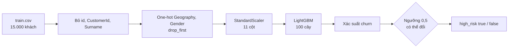
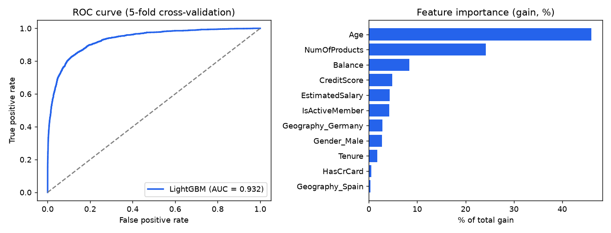
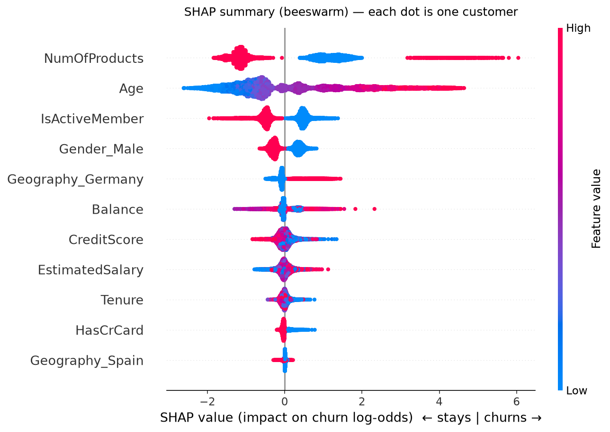
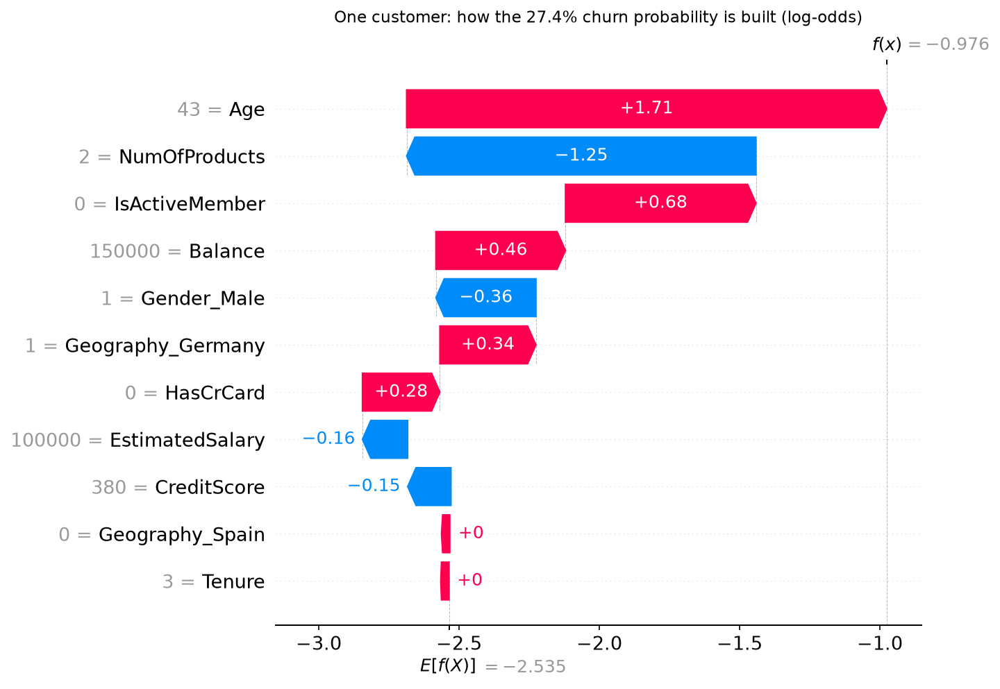
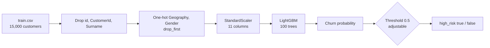

# 🏦 Bank Customer Churn Prediction

> LightGBM · FastAPI · Docker · SHAP · 5-fold CV ROC-AUC **0.932**

**🔗 Live demo:** `https://<YOUR-RENDER-URL>/docs` &nbsp;_(free tier: the first request after inactivity can take ~1 minute / bản miễn phí: request đầu tiên sau thời gian không dùng có thể mất ~1 phút)_

**Language / Ngôn ngữ:** [🇻🇳 Tiếng Việt](#vi) · [🇬🇧 English](#en)

---

<a id="vi"></a>

# 🇻🇳 Tiếng Việt

> **Dự đoán khách hàng ngân hàng sắp rời bỏ, giải thích lý do, và triển khai thành REST API.**

## Tóm tắt nhanh

| | |
|---|---|
| **Bài toán** | Phân loại nhị phân: khách hàng có rời ngân hàng (`Exited = 1`) hay không |
| **Dữ liệu** | 15.000 khách hàng, tỉ lệ churn 20,4 % (dữ liệu tổng hợp từ Kaggle) |
| **Mô hình cuối** | LightGBM + StandardScaler + one-hot, gói trong một `Pipeline` scikit-learn |
| **Kết quả** | ROC-AUC **0,932**, F1 (churn) 0,737, Precision 0,795, Recall 0,688 (5-fold CV) |
| **Giá trị nghiệp vụ** | Liên hệ 20 % khách rủi ro cao nhất → bắt được **~74 % khách thực sự rời đi** (gấp 3,7 lần chọn ngẫu nhiên) |
| **Yếu tố chính** | Số sản phẩm đang dùng, tuổi, có hoạt động hay không, quốc gia (Germany), giới tính |
| **Triển khai** | FastAPI + Docker, có Swagger UI tại `/docs` |

**Chạy thử nhanh:**
```bash
pip install -r requirements.txt
uvicorn api:app --reload        # mở http://127.0.0.1:8000/docs
```

## Mục lục
1. [Bài toán](#vi-1) · 2. [Dữ liệu](#vi-2) · 3. [Phương pháp](#vi-3) · 4. [Cấu hình & tham số](#vi-4) · 5. [Kết quả](#vi-5) · 6. [Giải thích mô hình](#vi-6) · 7. [Kết luận](#vi-7) · 8. [Sử dụng API](#vi-8) · 9. [Chạy dự án](#vi-9) · 10. [Cấu trúc repo](#vi-10)

<a id="vi-1"></a>

## 1. Bài toán

Chi phí để có khách hàng mới cao hơn nhiều so với giữ khách hiện tại. Ngân hàng cần **phát hiện sớm khách hàng có nguy cơ rời đi** để chỉ gửi ưu đãi giữ chân cho nhóm này, thay vì liên hệ tất cả.

Dự án trả lời ba câu hỏi:
1. **Ai** có khả năng rời đi cao nhất? → điểm xác suất churn cho từng khách.
2. **Vì sao** họ có nguy cơ cao? → phân tích SHAP (mục 6).
3. **Làm sao dùng được** trong hệ thống thực? → REST API (mục 8).

<a id="vi-2"></a>

## 2. Dữ liệu

| | |
|---|---|
| Nguồn | Kaggle – [Bank Customer Churn Prediction Challenge](https://www.kaggle.com/competitions/bank-customer-churn-prediction-challenge/data) |
| Quy mô | 15.000 khách hàng có nhãn (`train.csv`), 10.000 khách chưa có nhãn (`test.csv`) |
| Biến mục tiêu | `Exited` – 1 nếu khách đã rời ngân hàng (**20,4 %**) |
| Đặc trưng | `CreditScore`, `Geography`, `Gender`, `Age`, `Tenure`, `Balance`, `NumOfProducts`, `HasCrCard`, `IsActiveMember`, `EstimatedSalary` |
| Cột bị bỏ | `id`, `CustomerId`, `Surname` (định danh, không mang thông tin dự đoán) |
| Chất lượng | Không thiếu giá trị, không trùng lặp. Ngoại lai được giữ lại vì có ý nghĩa thực tế |

> ⚠️ Dữ liệu là **dữ liệu tổng hợp** (sinh ra bởi một mô hình được huấn luyện trên dữ liệu churn ngân hàng gốc), nên kết quả minh họa phương pháp, không phản ánh một ngân hàng thật.

<a id="vi-3"></a>

## 3. Phương pháp



**Quy trình thực hiện** (chi tiết trong `notebooks/Customer_Churn.ipynb`):

1. **EDA** – phân tích đơn biến / đa biến, kiểm định thống kê, kiểm tra ngoại lai.
2. **Feature engineering** – 4 phiên bản dữ liệu × 2 bộ chuẩn hóa = **8 phiên bản**:
   - *Dummies*: one-hot cho biến phân loại
   - *Catcode*: mã hóa nhãn (label encoding) cho biến phân loại
   - *Binning*: chia khoảng các biến số (tuổi, số dư, lương, điểm tín dụng, thời gian gắn bó)
   - *Add/Remove*: dùng Catcode kèm under-sampling nhóm không churn
   - Chuẩn hóa: *MinMax* hoặc *Standard*
3. **Mô hình hóa** – 7 thuật toán × 8 phiên bản dữ liệu, mỗi tổ hợp đánh giá bằng **5-fold stratified cross-validation**: Logistic Regression, Decision Tree, Random Forest, Extra Trees, XGBoost, **LightGBM**, CatBoost.
4. **Chọn mô hình** – **LightGBM + Standard + Dummies** (xem mục 5.3 để biết lý do).
5. **Giải thích** – SHAP (beeswarm, waterfall) để hiểu mô hình dùng đặc trưng nào và theo chiều nào.
6. **Triển khai** – gộp tiền xử lý + mô hình vào **một** `Pipeline` để tránh lệch cột/scaler giữa lúc train và lúc phục vụ → FastAPI → Docker.

<a id="vi-4"></a>

## 4. Cấu hình & tham số

### 4.1 Tiền xử lý
| Bước | Cấu hình |
|---|---|
| Cột bỏ | `id`, `CustomerId`, `Surname` |
| Biến số (8 cột) | `CreditScore`, `Age`, `Tenure`, `Balance`, `NumOfProducts`, `HasCrCard`, `IsActiveMember`, `EstimatedSalary` (giữ nguyên) |
| One-hot | `Geography` (`France`, `Germany`, `Spain`) và `Gender` (`Female`, `Male`) với `drop="first"` → 3 cột: `Geography_Germany`, `Geography_Spain`, `Gender_Male` |
| Giá trị lạ lúc phục vụ | `handle_unknown="ignore"` |
| Chuẩn hóa | `StandardScaler` trên cả 11 cột (mô hình cây không nhạy với thang đo, giữ lại để khớp đúng cấu hình đã thử nghiệm trong notebook) |
| Thiếu dữ liệu / ngoại lai / resampling | Không có thiếu dữ liệu; không xử lý ngoại lai; **không** resampling |

### 4.2 Siêu tham số LightGBM (`train.py`)
| Tham số | Giá trị | Ghi chú |
|---|---|---|
| `n_estimators` | 100 | đặt tường minh |
| `random_state` | 96 | đặt tường minh, để kết quả tái lập được |
| `scale_pos_weight` | 1.0 | đặt tường minh (không bù mất cân bằng lớp) |
| `verbose` | -1 | tắt log |
| `learning_rate` | 0.1 | mặc định của LightGBM |
| `num_leaves` | 31 | mặc định |
| `max_depth` | -1 (không giới hạn) | mặc định |
| `min_child_samples` | 20 | mặc định |
| `subsample`, `colsample_bytree` | 1.0, 1.0 | mặc định |
| `reg_alpha`, `reg_lambda` | 0.0, 0.0 | mặc định |
| `objective` | `binary` | tự suy ra |

> **Không tinh chỉnh siêu tham số.** Ngoài các tham số được đặt tường minh ở trên, mô hình dùng toàn bộ giá trị mặc định của LightGBM. Mô hình cuối được huấn luyện trên toàn bộ 15.000 dòng.

### 4.3 Đánh giá
| Mục | Cấu hình |
|---|---|
| Chia dữ liệu | `StratifiedKFold(n_splits=5, shuffle=True, random_state=96)` |
| Dự đoán | out-of-fold (mỗi khách được dự đoán bởi mô hình không nhìn thấy khách đó) |
| Ngưỡng phân loại | 0,5 |
| Chỉ số | ROC-AUC, và Precision / Recall / F1 của **lớp churn** |

### 4.4 Phục vụ (API & Docker)
| Mục | Cấu hình |
|---|---|
| Đường dẫn mô hình | `model/churn_pipeline.joblib` (nạp một lần khi khởi động) |
| Ngưỡng mặc định | 0,5, đổi bằng `?threshold=` |
| Image | `python:3.12-slim` (+ `libgomp1` cho LightGBM) |
| Cổng | `7860` mặc định, hoặc biến môi trường `PORT` |
| Phiên bản thư viện | `scikit-learn==1.6.1`, `lightgbm==4.6.0`, `pandas==2.2.3`, `numpy==2.1.3` (Python 3.12) |

> ⚠️ File `.joblib` được lưu bằng scikit-learn 1.6.1. Hãy dùng đúng phiên bản trong `requirements.txt`; phiên bản khác có thể gây cảnh báo hoặc không nạp được mô hình.

<a id="vi-5"></a>

## 5. Kết quả

### 5.1 Chỉ số chính

5-fold cross-validation trên 15.000 khách (ngưỡng 0,5):

| Chỉ số | Điểm |
|---|---|
| **ROC-AUC** | **0,932** |
| F1 (lớp churn) | 0,737 |
| Precision (lớp churn) | 0,795 |
| Recall (lớp churn) | 0,688 |

Ma trận nhầm lẫn (dự đoán out-of-fold):

| | Dự đoán ở lại | Dự đoán rời đi |
|---|---|---|
| **Thực tế ở lại** | 11.399 | 543 |
| **Thực tế rời đi** | 955 | 2.103 |



### 5.2 Ý nghĩa nghiệp vụ

Xếp hạng khách theo xác suất churn và chỉ liên hệ nhóm rủi ro cao nhất:

| Số khách được liên hệ (rủi ro cao nhất trước) | Tỉ lệ khách rời đi bắt được | Tỉ lệ trúng | Lift so với ngẫu nhiên |
|---|---|---|---|
| Top 10 % | 45 % | 92 % | 4,5× |
| **Top 20 %** | **74 %** | **75 %** | **3,7×** |
| Top 30 % | 86 % | 59 % | 2,9× |

Nghĩa là: nếu ngân hàng chỉ gửi ưu đãi cho 20 % khách có điểm cao nhất, cứ 100 khách được liên hệ thì khoảng 75 khách thực sự định rời đi, và tổng cộng bắt được khoảng 3/4 số khách rời đi.

### 5.3 So sánh các mô hình

Điểm trung bình 5 fold của **lớp churn**, trên phiên bản dữ liệu **Standard + Dummies** (phiên bản được chọn), lấy từ notebook:

| Mô hình | Precision | Recall | F1 |
|---|---|---|---|
| Logistic Regression | 0,547 | 0,805 | 0,651 |
| Decision Tree | 0,629 | 0,626 | 0,627 |
| Random Forest | 0,799 | 0,650 | 0,717 |
| Extra Trees | 0,783 | 0,653 | 0,712 |
| XGBoost | 0,769 | 0,670 | 0,716 |
| **LightGBM** | 0,795 | **0,683** | **0,734** |
| CatBoost | 0,804 | 0,675 | 0,734 |

LightGBM và CatBoost cùng đạt F1 cao nhất (0,734); LightGBM có Recall cao hơn một chút nên được chọn. Logistic Regression có Recall cao nhất nhưng Precision thấp (nhiều cảnh báo sai). Các mô hình họ cây tăng cường (boosting) vượt rõ rệt mô hình đơn giản.

Mô hình tốt nhất (theo F1) trên từng phiên bản dữ liệu:

| Phiên bản dữ liệu | Mô hình tốt nhất | F1 trung bình |
|---|---|---|
| MinMax – Dummies | LightGBM | 0,736 |
| MinMax – Binning | LightGBM | 0,709 |
| MinMax – Catcode | CatBoost | 0,735 |
| MinMax – Add/Remove ⚠️ | CatBoost | 0,805 |
| **Standard – Dummies (đã chọn)** | **LightGBM** | **0,735** |
| Standard – Binning | LightGBM | 0,709 |
| Standard – Catcode | LightGBM | 0,734 |
| Standard – Add/Remove ⚠️ | CatBoost | 0,804 |

> ⚠️ **Add/Remove không so sánh trực tiếp được.** Phiên bản này under-sample nhóm không churn **trước** khi cross-validation, nên F1 (~0,80) đo trên tỉ lệ lớp khác (churn ~34 % thay vì 20 %). Khi đánh giá cùng ý tưởng trên tỉ lệ churn tự nhiên 20 %, F1 khoảng 0,74, tương đương mô hình triển khai. Ngoài ra, F1 ở đây là trung bình 4 phép đo theo fold (0,734–0,735) còn bảng ở mục 5.1 là gộp dự đoán out-of-fold (0,737), nên hai con số chênh nhẹ.

<a id="vi-6"></a>

## 6. Giải thích mô hình

Phần này trả lời: *mô hình dựa vào đâu để dự đoán?* SHAP (SHapley Additive exPlanations) chia dự đoán của từng khách thành đóng góp của từng đặc trưng. Giá trị SHAP dương đẩy dự đoán về phía **rời đi**, âm đẩy về phía **ở lại** (đơn vị log-odds).

### 6.1 Toàn cục: đặc trưng nào quan trọng và tác động thế nào?



**Cách đọc:** mỗi chấm là một khách; vị trí ngang là mức đẩy dự đoán; màu là giá trị đặc trưng (đỏ = cao, xanh = thấp). Các đặc trưng xếp theo mức tác động từ trên xuống.
- **NumOfProducts:** cụm đỏ bên trái là khách có 2 sản phẩm (nguy cơ thấp, màu đỏ vì thang màu của biểu đồ), cụm xanh bên phải là 1 sản phẩm (nguy cơ cao hơn), và các chấm đỏ xa bên phải là khách có 3–4 sản phẩm (nguy cơ rất cao).
- **Age:** chấm xanh (trẻ) nằm bên trái, chấm đỏ (lớn tuổi) nằm bên phải, tuổi càng cao nguy cơ càng lớn.
- **IsActiveMember, Gender_Male:** đỏ (= 1) nằm bên trái, nghĩa là khách hoạt động và nam giới ít rời đi hơn.
- **Geography_Germany:** đỏ (= 1) nằm bên phải, khách ở Germany dễ rời đi hơn.

| Đặc trưng | Mean \|SHAP\| | Tỉ trọng |
|---|---|---|
| **NumOfProducts** | 1,234 | 29,9 % |
| **Age** | 1,233 | 29,9 % |
| IsActiveMember | 0,520 | 12,6 % |
| Gender_Male | 0,326 | 7,9 % |
| Geography_Germany | 0,219 | 5,3 % |
| Balance | 0,195 | 4,7 % |
| CreditScore | 0,127 | 3,1 % |
| EstimatedSalary | 0,121 | 2,9 % |
| Tenure | 0,071 | 1,7 % |
| HasCrCard | 0,063 | 1,5 % |
| Geography_Spain | 0,021 | 0,5 % |

**Gain importance và SHAP:** biểu đồ ở mục 5.1 dùng *gain* (mức giảm sai số khi chia nhánh) và xếp Age (46 %) > NumOfProducts (24 %) > Balance (8 %). SHAP đo mức *thực sự đẩy dự đoán* và xếp NumOfProducts ≈ Age (~30 % mỗi cái), rồi IsActiveMember. Hai cách đều thống nhất Age và NumOfProducts là hai yếu tố hàng đầu; gain thiên về các biến liên tục có nhiều điểm chia (như `Balance`), nên SHAP đáng tin hơn khi giải thích dự đoán.

### 6.2 Tỉ lệ churn thực tế theo từng nhóm

| Đặc trưng | Nhóm | Số khách | Tỉ lệ churn | SHAP TB |
|---|---|---|---|---|
| **Age** | ≤ 30 | 2.492 | 3,3 % | −1,58 |
| | 31–40 | 7.881 | 8,9 % | −0,61 |
| | 41–50 | 3.382 | 41,5 % | +1,48 |
| | 51–60 | 995 | 76,5 % | +3,53 |
| | > 60 | 250 | 42,8 % | +2,50 |
| **NumOfProducts** | 1 | 6.437 | 38,1 % | +1,18 |
| | 2 | 8.305 | 4,3 % | −1,18 |
| | 3 | 218 | 95,4 % | +4,35 |
| | 4 | 40 | 97,5 % | +4,57 |
| **IsActiveMember** | 0 | 7.497 | 28,7 % | +0,50 |
| | 1 | 7.503 | 12,1 % | −0,54 |
| **Geography** | Germany | 2.708 | 42,0 % | +0,66 |
| | France | 8.971 | 15,5 % | −0,12 |
| | Spain | 3.321 | 15,9 % | −0,12 |
| **Gender** | Female | — | 28,3 % | — |
| | Male | — | 14,1 % | — |
| **Balance** | = 0 | 9.684 | 15,8 % | — |
| | > 0 | 5.316 | 28,8 % | — |

### 6.3 Cục bộ: giải thích một khách hàng



Đây là khách trong ví dụ `curl` ở mục 8 (CreditScore 380, Germany, Male, 43 tuổi, 3 năm gắn bó, số dư 150.000, 2 sản phẩm, không có thẻ tín dụng, không hoạt động, lương 100.000). Mô hình bắt đầu từ giá trị cơ sở −2,535 (≈ 7,3 % xác suất, mức trung bình của toàn tập) rồi cộng/trừ đóng góp từng đặc trưng:
- **Tuổi 43** đẩy mạnh nhất về phía rời đi (+1,71), cùng với **không hoạt động** (+0,68) và **số dư 150.000** (+0,46).
- **Có 2 sản phẩm** kéo ngược lại gần như tương đương (−1,25).
- Kết quả cuối −0,976 → **xác suất 27,4 %**, dưới ngưỡng 0,5 nên `high_risk = false`.

### 6.4 Tự tính SHAP

Không cần cài thư viện `shap` để lấy giá trị SHAP, vì LightGBM hỗ trợ sẵn:

```python
import joblib, pandas as pd

pipe = joblib.load("model/churn_pipeline.joblib")
X = pd.read_csv("data/train.csv")[["CreditScore", "Geography", "Gender", "Age", "Tenure",
                                   "Balance", "NumOfProducts", "HasCrCard",
                                   "IsActiveMember", "EstimatedSalary"]]

Z = pipe[:-1].transform(X)                                   # tiền xử lý + chuẩn hóa
contrib = pipe[-1].predict(Z, pred_contrib=True)             # shape (n, 12)
shap_values = pd.DataFrame(contrib[:, :-1], columns=pipe[:-1].get_feature_names_out())
baseline = contrib[0, -1]                                    # cột cuối = giá trị cơ sở
```

Với mỗi khách: `baseline + tổng shap_values` = log-odds; áp hàm sigmoid ra đúng `churn_probability` mà API trả về. Để vẽ lại biểu đồ, dùng thư viện `shap` (`shap.plots.beeswarm`, `shap.plots.waterfall`) trên các giá trị này.

<a id="vi-7"></a>

## 7. Kết luận

### Dự án đạt được gì
- Xây dựng được mô hình dự đoán churn với **ROC-AUC 0,932** và **F1 0,737** (lớp churn), đánh giá bằng 5-fold cross-validation có phân tầng.
- Nếu chỉ liên hệ **20 % khách rủi ro cao nhất**, bắt được **~74 % số khách thực sự rời đi** với tỉ lệ trúng 75 %, hiệu quả gấp **3,7 lần** chọn ngẫu nhiên.
- Mô hình được đóng gói thành một `Pipeline` duy nhất và phục vụ qua **API** (FastAPI + Docker), nên hệ thống khác có thể gọi trực tiếp.

### Điều mô hình cho thấy về khách hàng rời đi
- **Số sản phẩm** và **tuổi** là hai yếu tố mạnh nhất (cùng ~60 % tổng tác động theo SHAP).
- Nguy cơ tăng mạnh từ **41 tuổi**, cao nhất ở nhóm **51–60 tuổi** (76,5 % rời đi).
- Khách có **2 sản phẩm** rất ít rời đi (4,3 %); khách có **1 sản phẩm** rời đi nhiều (38,1 %); khách có **3–4 sản phẩm** gần như đều rời đi (nhưng chỉ ~1,7 % tổng số khách).
- Khách **không hoạt động**, ở **Germany**, **nữ**, hoặc có **số dư > 0** có tỉ lệ rời đi cao hơn.

### Gợi ý hành động (giả thuyết cần kiểm chứng, không phải kết luận nhân quả)
1. Ưu tiên chương trình giữ chân cho nhóm điểm cao nhất (top 10–20 %), đặc biệt khách trên 40 tuổi, chỉ dùng 1 sản phẩm hoặc không hoạt động.
2. Tìm hiểu vì sao khách 3–4 sản phẩm gần như đều rời đi (phí, trải nghiệm, hay đặc điểm của dữ liệu).
3. Chọn ngưỡng quyết định theo **chi phí của một ưu đãi giữ chân so với giá trị của một khách được giữ lại**, thay vì cố định 0,5.
4. Xem xét nguyên nhân khách ở Germany rời đi nhiều gấp hơn 2,5 lần Pháp/Tây Ban Nha.

### Hạn chế
- Dữ liệu tổng hợp; chỉ số cross-validate trên 15.000 dòng, **chưa kiểm tra** trên tập hold-out thực tế riêng biệt, nên các mối quan hệ (ví dụ nhóm 3–4 sản phẩm gần 100 % churn) có thể không giống ngân hàng thật.
- SHAP chỉ cho biết mô hình *dùng gì để dự đoán*, **không** chứng minh quan hệ nhân quả; SHAP được tính trên chính dữ liệu đã huấn luyện, chưa kiểm tra độ ổn định trên dữ liệu mới.
- Chưa tinh chỉnh siêu tham số, chưa hiệu chỉnh xác suất (calibration).
- Demo công khai không có xác thực và chạy trên gói miễn phí (khởi động nguội ≈ 1 phút).

### Hướng phát triển
Tinh chỉnh siêu tham số (ví dụ Optuna), hiệu chỉnh xác suất, chọn ngưỡng theo chi phí – lợi ích thực tế, kiểm tra trên dữ liệu thực, thêm giám sát dữ liệu/mô hình và xác thực cho API.

<a id="vi-8"></a>

## 8. Sử dụng API

| Phương thức | Endpoint | Mô tả |
|---|---|---|
| GET | `/health` | Kiểm tra trạng thái |
| POST | `/predict` | Chấm điểm một khách hàng |
| POST | `/predict_batch` | Chấm điểm một danh sách khách hàng |
| GET | `/docs` | Giao diện Swagger UI |

Cả hai endpoint dự đoán đều nhận tham số tùy chọn `?threshold=0.5`.

```bash
curl -X POST "https://<YOUR-RENDER-URL>/predict" \
  -H "Content-Type: application/json" \
  -d '{
    "CreditScore": 380, "Geography": "Germany", "Gender": "Male", "Age": 43,
    "Tenure": 3, "Balance": 150000, "NumOfProducts": 2,
    "HasCrCard": 0, "IsActiveMember": 0, "EstimatedSalary": 100000
  }'
```

```json
{ "churn_probability": 0.2738, "high_risk": false, "threshold": 0.5 }
```

| Trường | Giá trị cho phép |
|---|---|
| `CreditScore` | 300 – 850 |
| `Geography` | `France`, `Germany`, `Spain` |
| `Gender` | `Female`, `Male` |
| `Age` | 18 – 100 |
| `Tenure` (năm) | 0 – 10 |
| `Balance`, `EstimatedSalary` | ≥ 0 |
| `NumOfProducts` | 1 – 4 |
| `HasCrCard`, `IsActiveMember` | 0 hoặc 1 |

Dữ liệu không hợp lệ trả về HTTP 422 kèm giải thích.

<a id="vi-9"></a>

## 9. Chạy dự án

**Chạy local**
```bash
pip install -r requirements.txt
python train.py --train data/train.csv     # tùy chọn: huấn luyện lại, ghi ra model/churn_pipeline.joblib
uvicorn api:app --reload                   # mở http://127.0.0.1:8000/docs
```

**Chạy bằng Docker**
```bash
docker build -t churn-api .
docker run -p 8000:7860 churn-api          # mở http://127.0.0.1:8000/docs
```

**Triển khai:** repository có thể deploy nguyên trạng lên bất kỳ host Docker nào (bản demo chạy trên gói miễn phí của Render; container đọc biến `PORT`).

<a id="vi-10"></a>

## 10. Cấu trúc repository

```
├── api.py                  # dịch vụ FastAPI
├── train.py                # huấn luyện lại mô hình và báo cáo chỉ số CV
├── model/
│   ├── churn_pipeline.joblib   # pipeline đã huấn luyện (tiền xử lý + LightGBM)
│   └── metrics.json            # chỉ số cross-validation
├── notebooks/
│   └── Customer_Churn.ipynb    # EDA, feature engineering, so sánh mô hình
├── data/                   # train.csv, test.csv, sample_submission.csv
├── assets/
│   ├── results.png             # ROC curve + feature importance
│   ├── shap_beeswarm.png       # SHAP toàn cục
│   └── shap_waterfall.png      # SHAP cho một khách hàng
├── Dockerfile
└── requirements.txt
```

**Công nghệ:** Python · pandas · scikit-learn · LightGBM · FastAPI · Uvicorn · Docker (phân tích SHAP: `shap`, `matplotlib`)

---

<a id="en"></a>

# 🇬🇧 English

> **Predict which bank customers are about to leave, explain why, and serve the prediction as a REST API.**

## At a glance

| | |
|---|---|
| **Problem** | Binary classification: will a customer leave the bank (`Exited = 1`)? |
| **Data** | 15,000 customers, 20.4 % churn rate (synthetic Kaggle data) |
| **Final model** | LightGBM + StandardScaler + one-hot, packaged in one scikit-learn `Pipeline` |
| **Results** | ROC-AUC **0.932**, F1 (churn) 0.737, Precision 0.795, Recall 0.688 (5-fold CV) |
| **Business value** | Contacting the top 20 % highest-risk customers catches **~74 % of customers who actually leave** (3.7× better than random) |
| **Key drivers** | Number of products, age, activity status, country (Germany), gender |
| **Deployment** | FastAPI + Docker, with Swagger UI at `/docs` |

**Quick try:**
```bash
pip install -r requirements.txt
uvicorn api:app --reload        # open http://127.0.0.1:8000/docs
```

## Contents
1. [Problem](#en-1) · 2. [Data](#en-2) · 3. [Approach](#en-3) · 4. [Configuration & parameters](#en-4) · 5. [Results](#en-5) · 6. [Explainability](#en-6) · 7. [Conclusion](#en-7) · 8. [Use the API](#en-8) · 9. [Run it yourself](#en-9) · 10. [Repository structure](#en-10)

<a id="en-1"></a>

## 1. The problem

Acquiring a new customer costs far more than keeping an existing one. A bank wants to **spot customers at risk of leaving early** and target retention offers only at them, instead of contacting everyone.

This project answers three questions:
1. **Who** is most likely to churn? → a probability score per customer.
2. **Why** are they at risk? → SHAP analysis (section 6).
3. **How can it be used** in a real system? → a REST API (section 8).

<a id="en-2"></a>

## 2. Data

| | |
|---|---|
| Source | Kaggle – [Bank Customer Churn Prediction Challenge](https://www.kaggle.com/competitions/bank-customer-churn-prediction-challenge/data) |
| Size | 15,000 labelled customers (`train.csv`), 10,000 unlabelled (`test.csv`) |
| Target | `Exited` – 1 if the customer left the bank (**20.4 %**) |
| Features | `CreditScore`, `Geography`, `Gender`, `Age`, `Tenure`, `Balance`, `NumOfProducts`, `HasCrCard`, `IsActiveMember`, `EstimatedSalary` |
| Dropped columns | `id`, `CustomerId`, `Surname` (identifiers, no predictive information) |
| Quality | No missing values, no duplicates. Outliers kept because they are realistic values |

> ⚠️ The dataset is **synthetic** (generated by a model trained on the original bank churn data), so results illustrate the method and are not a claim about a real bank.

<a id="en-3"></a>

## 3. Approach



**Workflow** (details in `notebooks/Customer_Churn.ipynb`):

1. **EDA** – univariate / multivariate analysis, statistical tests, outlier check.
2. **Feature engineering** – 4 data versions × 2 scalers = **8 versions**:
   - *Dummies*: one-hot encoding of categorical variables
   - *Catcode*: label encoding of categorical variables
   - *Binning*: bucketing numeric variables (age, balance, salary, credit score, tenure)
   - *Add/Remove*: Catcode plus under-sampling of non-churners
   - Scaling: *MinMax* or *Standard*
3. **Modelling** – 7 algorithms × 8 data versions, each evaluated with **5-fold stratified cross-validation**: Logistic Regression, Decision Tree, Random Forest, Extra Trees, XGBoost, **LightGBM**, CatBoost.
4. **Model selection** – **LightGBM + Standard + Dummies** (see section 5.3 for the reasoning).
5. **Explainability** – SHAP (beeswarm, waterfall) to see which features the model uses and in which direction.
6. **Deployment** – preprocessing and model combined in **one** `Pipeline` so train-time and serve-time columns/scaling cannot drift apart → FastAPI → Docker.

<a id="en-4"></a>

## 4. Configuration & parameters

### 4.1 Preprocessing
| Step | Setting |
|---|---|
| Dropped columns | `id`, `CustomerId`, `Surname` |
| Numeric (8 columns) | `CreditScore`, `Age`, `Tenure`, `Balance`, `NumOfProducts`, `HasCrCard`, `IsActiveMember`, `EstimatedSalary` (passed through) |
| One-hot | `Geography` (`France`, `Germany`, `Spain`) and `Gender` (`Female`, `Male`) with `drop="first"` → 3 columns: `Geography_Germany`, `Geography_Spain`, `Gender_Male` |
| Unknown values at serving time | `handle_unknown="ignore"` |
| Scaling | `StandardScaler` on all 11 columns (tree models are insensitive to scale; kept to match the exact configuration tested in the notebook) |
| Missing values / outliers / resampling | No missing values; outliers not treated; **no** resampling |

### 4.2 LightGBM hyper-parameters (`train.py`)
| Parameter | Value | Note |
|---|---|---|
| `n_estimators` | 100 | set explicitly |
| `random_state` | 96 | set explicitly, for reproducibility |
| `scale_pos_weight` | 1.0 | set explicitly (no class-imbalance compensation) |
| `verbose` | -1 | silence logs |
| `learning_rate` | 0.1 | LightGBM default |
| `num_leaves` | 31 | default |
| `max_depth` | -1 (unlimited) | default |
| `min_child_samples` | 20 | default |
| `subsample`, `colsample_bytree` | 1.0, 1.0 | default |
| `reg_alpha`, `reg_lambda` | 0.0, 0.0 | default |
| `objective` | `binary` | inferred |

> **No hyper-parameter tuning.** Apart from the parameters set explicitly above, the model uses LightGBM's defaults. The final model is trained on all 15,000 rows.

### 4.3 Evaluation
| Item | Setting |
|---|---|
| Split | `StratifiedKFold(n_splits=5, shuffle=True, random_state=96)` |
| Predictions | out-of-fold (each customer is scored by a model that never saw that customer) |
| Decision threshold | 0.5 |
| Metrics | ROC-AUC, and Precision / Recall / F1 of the **churn class** |

### 4.4 Serving (API & Docker)
| Item | Setting |
|---|---|
| Model path | `model/churn_pipeline.joblib` (loaded once at start-up) |
| Default threshold | 0.5, override with `?threshold=` |
| Image | `python:3.12-slim` (+ `libgomp1` for LightGBM) |
| Port | `7860` by default, or the `PORT` environment variable |
| Library versions | `scikit-learn==1.6.1`, `lightgbm==4.6.0`, `pandas==2.2.3`, `numpy==2.1.3` (Python 3.12) |

> ⚠️ The `.joblib` file was saved with scikit-learn 1.6.1. Use the versions in `requirements.txt`; other versions may raise warnings or fail to load the model.

<a id="en-5"></a>

## 5. Results

### 5.1 Headline metrics

5-fold cross-validation on 15,000 customers (threshold 0.5):

| Metric | Score |
|---|---|
| **ROC-AUC** | **0.932** |
| F1 (churn class) | 0.737 |
| Precision (churn class) | 0.795 |
| Recall (churn class) | 0.688 |

Confusion matrix (out-of-fold predictions):

| | Predicted stay | Predicted churn |
|---|---|---|
| **Actually stayed** | 11,399 | 543 |
| **Actually churned** | 955 | 2,103 |


### 5.2 What it means for the business

Rank customers by predicted churn probability and contact only the riskiest ones:

| Customers contacted (highest risk first) | Share of all churners caught | Hit rate | Lift vs. random |
|---|---|---|---|
| Top 10 % | 45 % | 92 % | 4.5× |
| **Top 20 %** | **74 %** | **75 %** | **3.7×** |
| Top 30 % | 86 % | 59 % | 2.9× |

In plain terms: if the bank sends retention offers only to the top 20 % scored customers, about 75 out of every 100 contacted customers really were about to leave, and about three quarters of all leavers are reached.

### 5.3 Model comparison

Mean 5-fold scores for the **churn class** on the **Standard + Dummies** data version (the selected one), from the notebook:

| Model | Precision | Recall | F1 |
|---|---|---|---|
| Logistic Regression | 0.547 | 0.805 | 0.651 |
| Decision Tree | 0.629 | 0.626 | 0.627 |
| Random Forest | 0.799 | 0.650 | 0.717 |
| Extra Trees | 0.783 | 0.653 | 0.712 |
| XGBoost | 0.769 | 0.670 | 0.716 |
| **LightGBM** | 0.795 | **0.683** | **0.734** |
| CatBoost | 0.804 | 0.675 | 0.734 |

LightGBM and CatBoost tie for the best F1 (0.734); LightGBM has slightly higher recall, so it was chosen. Logistic Regression has the highest recall but low precision (many false alarms). Gradient-boosted trees clearly beat the simpler models.

Best model (by F1) on each data version:

| Data version | Best model | Mean F1 |
|---|---|---|
| MinMax – Dummies | LightGBM | 0.736 |
| MinMax – Binning | LightGBM | 0.709 |
| MinMax – Catcode | CatBoost | 0.735 |
| MinMax – Add/Remove ⚠️ | CatBoost | 0.805 |
| **Standard – Dummies (selected)** | **LightGBM** | **0.735** |
| Standard – Binning | LightGBM | 0.709 |
| Standard – Catcode | LightGBM | 0.734 |
| Standard – Add/Remove ⚠️ | CatBoost | 0.804 |

> ⚠️ **Add/Remove is not directly comparable.** This version under-samples non-churners **before** cross-validation, so its F1 (~0.80) is measured on a different class balance (~34 % churn instead of 20 %). When the same idea is evaluated on the natural 20 % churn rate, F1 is about 0.74, in line with the deployed model. Also note that F1 here is the mean of per-fold scores (0.734–0.735), while the table in section 5.1 pools out-of-fold predictions (0.737), so the two differ slightly.

<a id="en-6"></a>

## 6. Model explainability

This section answers: *what does the model rely on?* SHAP (SHapley Additive exPlanations) splits each customer's prediction into per-feature contributions. A positive SHAP value pushes the prediction toward **leaving**, a negative one toward **staying** (in log-odds).

### 6.1 Global: which features matter and how?


**How to read it:** each dot is a customer; horizontal position is how much the feature pushes the prediction; colour is the feature value (red = high, blue = low). Features are sorted by impact from top to bottom.
- **NumOfProducts:** the red cluster on the left is customers with 2 products (low risk; shown red because of the plot's colour scale), the blue cluster on the right is 1 product (higher risk), and the red dots far right are customers with 3–4 products (very high risk).
- **Age:** blue (young) dots sit on the left, red (older) dots on the right; the older the customer, the higher the risk.
- **IsActiveMember, Gender_Male:** red (= 1) sits on the left, so active members and men leave less often.
- **Geography_Germany:** red (= 1) sits on the right, so customers in Germany leave more often.

| Feature | Mean \|SHAP\| | Share |
|---|---|---|
| **NumOfProducts** | 1.234 | 29.9 % |
| **Age** | 1.233 | 29.9 % |
| IsActiveMember | 0.520 | 12.6 % |
| Gender_Male | 0.326 | 7.9 % |
| Geography_Germany | 0.219 | 5.3 % |
| Balance | 0.195 | 4.7 % |
| CreditScore | 0.127 | 3.1 % |
| EstimatedSalary | 0.121 | 2.9 % |
| Tenure | 0.071 | 1.7 % |
| HasCrCard | 0.063 | 1.5 % |
| Geography_Spain | 0.021 | 0.5 % |

**Gain importance vs. SHAP:** the chart in section 5.1 uses *gain* (error reduction when splitting) and ranks Age (46 %) > NumOfProducts (24 %) > Balance (8 %). SHAP measures how much a feature *actually moves predictions* and ranks NumOfProducts ≈ Age (~30 % each), then IsActiveMember. Both agree that Age and NumOfProducts are the top two; gain favours continuous features with many split points (like `Balance`), so SHAP is the more reliable measure for explaining predictions.

### 6.2 Observed churn rate by group

| Feature | Group | Customers | Churn rate | Mean SHAP |
|---|---|---|---|---|
| **Age** | ≤ 30 | 2,492 | 3.3 % | −1.58 |
| | 31–40 | 7,881 | 8.9 % | −0.61 |
| | 41–50 | 3,382 | 41.5 % | +1.48 |
| | 51–60 | 995 | 76.5 % | +3.53 |
| | > 60 | 250 | 42.8 % | +2.50 |
| **NumOfProducts** | 1 | 6,437 | 38.1 % | +1.18 |
| | 2 | 8,305 | 4.3 % | −1.18 |
| | 3 | 218 | 95.4 % | +4.35 |
| | 4 | 40 | 97.5 % | +4.57 |
| **IsActiveMember** | 0 | 7,497 | 28.7 % | +0.50 |
| | 1 | 7,503 | 12.1 % | −0.54 |
| **Geography** | Germany | 2,708 | 42.0 % | +0.66 |
| | France | 8,971 | 15.5 % | −0.12 |
| | Spain | 3,321 | 15.9 % | −0.12 |
| **Gender** | Female | — | 28.3 % | — |
| | Male | — | 14.1 % | — |
| **Balance** | = 0 | 9,684 | 15.8 % | — |
| | > 0 | 5,316 | 28.8 % | — |

### 6.3 Local: explaining one customer


This is the customer from the `curl` example in section 8 (CreditScore 380, Germany, Male, age 43, tenure 3, balance 150,000, 2 products, no credit card, inactive, salary 100,000). The model starts from a baseline of −2.535 (≈ 7.3 % probability, the dataset average) and adds each feature's contribution:
- **Age 43** is the strongest push toward leaving (+1.71), followed by **being inactive** (+0.68) and a **balance of 150,000** (+0.46).
- **Holding 2 products** pulls back almost as strongly (−1.25).
- The final value is −0.976 → **27.4 % probability**, below the 0.5 threshold, so `high_risk = false`.

### 6.4 Reproduce the SHAP values

No `shap` dependency is needed to get the values, because LightGBM supports them natively:

```python
import joblib, pandas as pd

pipe = joblib.load("model/churn_pipeline.joblib")
X = pd.read_csv("data/train.csv")[["CreditScore", "Geography", "Gender", "Age", "Tenure",
                                   "Balance", "NumOfProducts", "HasCrCard",
                                   "IsActiveMember", "EstimatedSalary"]]

Z = pipe[:-1].transform(X)                                   # preprocessing + scaling
contrib = pipe[-1].predict(Z, pred_contrib=True)             # shape (n, 12)
shap_values = pd.DataFrame(contrib[:, :-1], columns=pipe[:-1].get_feature_names_out())
baseline = contrib[0, -1]                                    # last column = baseline
```

For each customer, `baseline + sum(shap_values)` is the log-odds; applying the sigmoid gives exactly the `churn_probability` returned by the API. To redraw the charts, use the `shap` library (`shap.plots.beeswarm`, `shap.plots.waterfall`) on these values.

<a id="en-7"></a>

## 7. Conclusion

### What the project achieves
- A churn model with **ROC-AUC 0.932** and **F1 0.737** (churn class), evaluated with stratified 5-fold cross-validation.
- Contacting only the **top 20 % highest-risk customers** catches **~74 % of customers who actually leave** at a 75 % hit rate, **3.7×** better than random.
- The model is packaged as a single `Pipeline` and served through an **API** (FastAPI + Docker), so other systems can call it directly.

### What the model says about leavers
- **Number of products** and **age** are the two strongest drivers (together ~60 % of total SHAP impact).
- Risk rises sharply from **age 41** and peaks in the **51–60** group (76.5 % leave).
- Customers with **2 products** rarely leave (4.3 %); customers with **1 product** leave often (38.1 %); customers with **3–4 products** almost all leave (but they are only ~1.7 % of customers).
- **Inactive** customers, customers in **Germany**, **women**, and customers with a **balance > 0** leave more often.

### Suggested actions (hypotheses to test, not causal conclusions)
1. Prioritise retention offers for the top-scored customers (top 10–20 %), especially those over 40, with a single product, or inactive.
2. Investigate why customers with 3–4 products almost all leave (fees, experience, or an artefact of the data).
3. Choose the decision threshold from the **cost of a retention offer versus the value of a saved customer** instead of fixing it at 0.5.
4. Look into why customers in Germany leave more than 2.5× as often as those in France or Spain.

### Limitations
- Synthetic data; metrics are cross-validated on 15,000 rows and were **not checked** on a separate real-world hold-out set, so relationships (for example 3–4 products being almost 100 % churn) may not match a real bank.
- SHAP shows what the model *uses to predict*, **not** cause and effect; the SHAP values are computed on the same data the model was trained on, and their stability on new data has not been checked.
- No hyper-parameter tuning or probability calibration yet.
- The public demo has no authentication and runs on a free tier (cold start ≈ 1 minute).

### Next steps
Hyper-parameter tuning (e.g. Optuna), probability calibration, cost-based threshold selection, validation on real data, data/model monitoring and API authentication.

<a id="en-8"></a>

## 8. Use the API

| Method | Endpoint | Description |
|---|---|---|
| GET | `/health` | Health check |
| POST | `/predict` | Score one customer |
| POST | `/predict_batch` | Score a list of customers |
| GET | `/docs` | Interactive Swagger UI |

Both prediction endpoints accept an optional `?threshold=0.5` query parameter.

```bash
curl -X POST "https://<YOUR-RENDER-URL>/predict" \
  -H "Content-Type: application/json" \
  -d '{
    "CreditScore": 380, "Geography": "Germany", "Gender": "Male", "Age": 43,
    "Tenure": 3, "Balance": 150000, "NumOfProducts": 2,
    "HasCrCard": 0, "IsActiveMember": 0, "EstimatedSalary": 100000
  }'
```

```json
{ "churn_probability": 0.2738, "high_risk": false, "threshold": 0.5 }
```

| Field | Allowed values |
|---|---|
| `CreditScore` | 300 – 850 |
| `Geography` | `France`, `Germany`, `Spain` |
| `Gender` | `Female`, `Male` |
| `Age` | 18 – 100 |
| `Tenure` (years) | 0 – 10 |
| `Balance`, `EstimatedSalary` | ≥ 0 |
| `NumOfProducts` | 1 – 4 |
| `HasCrCard`, `IsActiveMember` | 0 or 1 |

Invalid input returns HTTP 422 with an explanation.

<a id="en-9"></a>

## 9. Run it yourself

**Locally**
```bash
pip install -r requirements.txt
python train.py --train data/train.csv     # optional: re-train, writes model/churn_pipeline.joblib
uvicorn api:app --reload                   # open http://127.0.0.1:8000/docs
```

**With Docker**
```bash
docker build -t churn-api .
docker run -p 8000:7860 churn-api          # open http://127.0.0.1:8000/docs
```

**Deployment:** the repository deploys as-is to any Docker host (the live demo runs on Render's free tier; the container reads the `PORT` variable).

<a id="en-10"></a>

## 10. Repository structure

```
├── api.py                  # FastAPI service
├── train.py                # re-trains the model and reports CV metrics
├── model/
│   ├── churn_pipeline.joblib   # trained pipeline (preprocessing + LightGBM)
│   └── metrics.json            # cross-validation metrics
├── notebooks/
│   └── Customer_Churn.ipynb    # EDA, feature engineering, model comparison
├── data/                   # train.csv, test.csv, sample_submission.csv
├── assets/
│   ├── results.png             # ROC curve + feature importance
│   ├── shap_beeswarm.png       # global SHAP
│   └── shap_waterfall.png      # SHAP for one customer
├── Dockerfile
└── requirements.txt
```

**Tech stack:** Python · pandas · scikit-learn · LightGBM · FastAPI · Uvicorn · Docker (SHAP analysis: `shap`, `matplotlib`)

---
